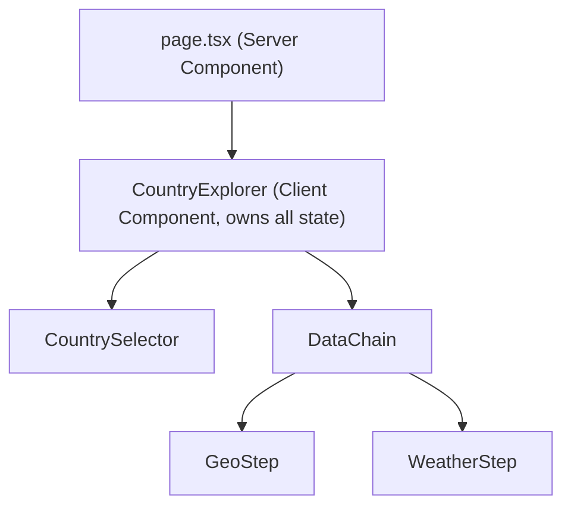
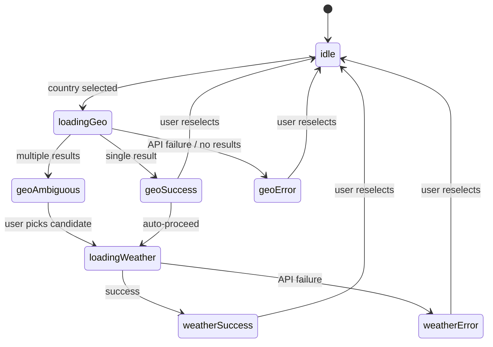

# Country Weather Explorer — Design Document

## Goals

Build a resilient, maintainable single-page app that orchestrates a 3-hop async data chain (Countries → Geocode → Weather) with strong state modeling, graceful failure handling, and clear data provenance.

---

## Architecture Overview




`page.tsx` stays a Server Component and renders `<CountryExplorer>` (a single Client Component boundary). All state lives in `CountryExplorer`, passed down as props.

---

## File Structure

```
src/
├── app/
│   ├── page.tsx                    # Server Component, renders CountryExplorer
│   ├── layout.tsx
│   └── globals.css
├── components/
│   ├── country-explorer.tsx        # Root client component, owns all state
│   ├── country-selector.tsx        # Combobox with search
│   ├── data-chain.tsx              # Orchestrates GeoStep + WeatherStep
│   ├── geo-step.tsx                # Geocode result card (handles ambiguity)
│   └── weather-step.tsx            # Weather result card
├── hooks/
│   ├── use-countries.ts            # Fetches + caches country list
│   └── use-weather-chain.ts        # Drives the geo → weather sequential fetch
├── lib/
│   ├── api/
│   │   ├── countries.ts            # REST Countries API client
│   │   ├── geocoding.ts            # Open-Meteo Geocoding client
│   │   └── weather.ts              # Open-Meteo Forecast client
│   ├── types.ts                    # All shared TypeScript types
│   └── utils.ts                    # cn() + misc helpers
└── ...
```

---

## Type System (`src/lib/types.ts`)

```typescript
// --- API response shapes ---
export interface Country {
  name: { common: string; official: string };
  cca2: string;
  capital: string[];
  region: string;
}

export interface GeoResult {
  id: number;
  name: string;
  latitude: number;
  longitude: number;
  country_code: string;
  admin1?: string;        // state/province for disambiguation
}

export interface WeatherResult {
  current: {
    time: string;
    temperature_2m: number;
    weather_code: number;
    wind_speed_10m: number;
  };
  current_units: {
    temperature_2m: string;
    wind_speed_10m: string;
  };
}

// --- State machine ---
export type AsyncState<T> =
  | { status: "idle" }
  | { status: "loading" }
  | { status: "success"; data: T; fetchedAt: number }
  | { status: "error"; message: string };
```

The `fetchedAt` timestamp on `success` drives data provenance display ("fetched N seconds ago").

---

## State Machine

All state lives in `CountryExplorer` via `useWeatherChain`. The chain is strictly sequential — each step only runs when the previous succeeds.




Key design decisions:

- If geocoding returns exactly 1 result, proceed automatically.
- If geocoding returns >1 result, surface a candidate picker before fetching weather.
- Changing the selected country resets the entire chain (no stale data shown).

---

## Async Strategy

### Race condition prevention

`useWeatherChain` uses an **abort controller ref** that is cancelled on every new country selection. This prevents out-of-order responses from a fast-typing user from corrupting state.

```typescript
// Pseudocode inside useWeatherChain
const abortRef = useRef<AbortController | null>(null);

function run(country: Country) {
  abortRef.current?.abort();
  const controller = new AbortController();
  abortRef.current = controller;
  // pass controller.signal into fetch calls
}
```

### Caching

- Country list: fetched once on mount, held in module-level memory (or `useRef`) — it never changes.
- Geocode + Weather: no client-side cache needed for v1 (results are ephemeral per-selection). Could add a `Map<cca2, GeoResult[]>` memo cheaply if needed.

---

## Error Handling

Each API call returns `AsyncState<T>` — errors are modeled as values, never thrown to the UI. Each step card independently renders its error state with a human-readable message. The country selector remains fully interactive at all times.

Edge cases explicitly handled:

- Country has no capital (`capital` array is empty) → show informative message, skip geo step.
- Geocoding returns 0 results → treat as error state.
- Network timeout / non-200 → surface as `error` state with `message`.

---

## Data Provenance

Each `success` state carries `fetchedAt: number` (Unix ms). Each step card displays:

```
Returned by {API Name} · {N}s ago
```

This satisfies the "visibility into data provenance" requirement without any global state.

---

## Component Responsibilities

- `**CountrySelector**` — Combobox built on shadcn `Command`/`Popover` (or `Select` + `Input` filter). Emits `onSelect(country: Country)`. Disabled while geo/weather are loading.
- `**GeoStep**` — Renders loading / error / single-result / multi-result (candidate picker) states. Emits `onCandidateSelect(geo: GeoResult)` when ambiguous.
- `**WeatherStep**` — Renders loading / error / success weather card. Shows temperature, wind speed, and WMO weather code mapped to a human-readable description + icon.
- `**DataChain**` — Stateless layout component; receives resolved state slices and renders `GeoStep` + `WeatherStep` in sequence.

---

## WMO Weather Code Mapping

Open-Meteo returns numeric WMO codes (e.g. `0` = Clear sky, `61` = Rain). A small lookup table in `src/lib/weather-codes.ts` maps codes to labels and Lucide icon names. This keeps the weather card clean without a third-party dependency.

---

## Testing Strategy

- Unit tests for API client functions (mock `fetch`, assert correct URL construction and response parsing).
- Unit tests for the `AsyncState` reducer / `useWeatherChain` hook (mock API modules).
- Smoke test for `CountryExplorer` rendering without errors.
- No E2E tests needed for v1 (pairing exercise scope).

---

## Extension Points (Discussion)

- **Side-by-side comparison**: `CountryExplorer` could hold an array of chain states (`chains: ChainState[]`) instead of a single one. The layout shifts from a single column to a grid.
- **Production observability**: Wrap each API call with a `trackSpan(name, fn)` helper that posts to an analytics endpoint or OpenTelemetry. The `fetchedAt` + elapsed time is already captured.
- **Persistent caching**: Geocode results could be stored in `localStorage` keyed by `cca2` with a TTL, since capitals rarely change.

