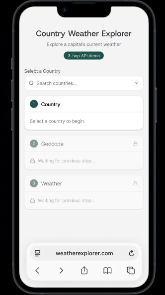

# Country Weather Explorer - Pairing Exercise

Build a small front-end app in a **45-minute pairing session**. The goal is not pixel perfection; the goal is to show strong state modeling, resilient async flows, and clear product thinking under time constraints.

## What You Are Building

A single-page app with a **3-hop data chain**:

1. **Country** - Select a country from a searchable list
2. **Geocode** - Resolve that country's capital to latitude/longitude
3. **Weather** - Fetch current weather for those coordinates

Each hop depends on the previous one, and any step can fail.

## Preview



## Design References

- [Design file](https://www.figma.com/design/yxIDUUzF4FMb1sadmy5srG/Country-Weather-Explorer?node-id=1-4)
- [Interactive prototype](https://www.figma.com/proto/yxIDUUzF4FMb1sadmy5srG/Country-Weather-Explorer?page-id=0%3A1&node-id=1-4&viewport=-920%2C-922%2C0.92&t=t4JwMYWp39BKQ0VV-1&scaling=scale-down&content-scaling=fixed&starting-point-node-id=1%3A4)

## APIs (Free, No Auth)

### 1) REST Countries - Country list + capital

`GET https://restcountries.com/v3.1/all?fields=name,cca2,capital,region`

- `capital` is an array; some countries have no listed capital
- Returns `name`, `cca2`, `capital`, and `region`
- Docs: <https://restcountries.com>

### 2) Open-Meteo Geocoding - Capital -> coordinates

`GET https://geocoding-api.open-meteo.com/v1/search?name={CAPITAL}&count=10&language=en&countryCode={CCA2}`

- Can return multiple results for one city name
- Docs: <https://open-meteo.com/en/docs/geocoding-api>

### 3) Open-Meteo Forecast - Coordinates -> weather

`GET https://api.open-meteo.com/v1/forecast?latitude={LAT}&longitude={LON}&current=temperature_2m,weather_code,wind_speed_10m&timezone=auto`

- Docs: <https://open-meteo.com/en/docs>

## API Quick Reference

Use these commands to validate responses fast during the exercise.

```bash
# Countries
curl "https://restcountries.com/v3.1/all?fields=name,cca2,capital,region" | head -c 500

# Geocode (example: Canberra, AU)
curl "https://geocoding-api.open-meteo.com/v1/search?name=Canberra&count=10&language=en&countryCode=AU"

# Weather (example: Canberra coords)
curl "https://api.open-meteo.com/v1/forecast?latitude=-35.28&longitude=149.13&current=temperature_2m,weather_code,wind_speed_10m&timezone=auto"
```

## Tech Stack

- Next.js (App Router)
- TypeScript (strongly preferred)
- Tailwind CSS
- shadcn/ui components are available if useful

## Evaluation Criteria

### Must-haves

- A country selector (dropdown/combobox)
- A results panel showing country -> geocode -> weather
- Graceful failure handling at each hop
- Visibility into data provenance (which API returned what, and when)
- Handling of ambiguous geocode results (multiple candidates)

### Discussion prompts

- What happens if the user changes countries rapidly?
- Where does caching provide the most value?
- How would you evolve this to compare two countries side-by-side?
- Where would you add production observability?

## Getting Started

```bash
npm install
npm run dev
```

Optional test command:

```bash
npm test
```

## What Success Looks Like

By the end of the session, the app should complete the full country -> geocode -> weather flow with thoughtful handling of loading, errors, ambiguity, and state transitions.

Clear tradeoff reasoning matters more than perfect completeness.