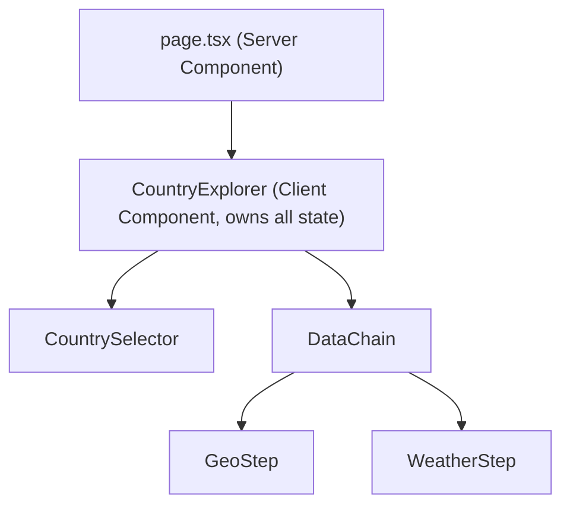
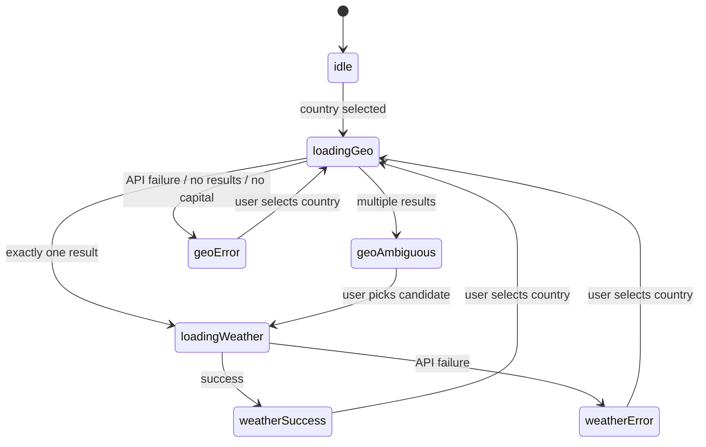

# Country Weather Explorer - Design Document

## Goals

Build a resilient, maintainable single-page app that orchestrates a 3-hop async data chain (Countries -> Geocode -> Weather) with strong state modeling, graceful failure handling, and clear data provenance.

## Architecture Overview



`page.tsx` stays a Server Component and renders `<CountryExplorer />` (a single Client Component boundary). All chain state lives in `CountryExplorer`, passed down as props.

## File Structure

```text
src/
|- app/
|  |- page.tsx                    # Server Component, renders CountryExplorer
|  |- layout.tsx
|  `- globals.css
|- components/
|  |- country-explorer.tsx        # Root client component, owns all state
|  |- country-selector.tsx        # Combobox with search
|  |- data-chain.tsx              # Orchestrates GeoStep + WeatherStep
|  |- geo-step.tsx                # Geocode result card (handles ambiguity)
|  `- weather-step.tsx            # Weather result card
|- hooks/
|  |- use-countries.ts            # Fetches + caches country list
|  `- use-weather-chain.ts        # Drives the geo -> weather sequential fetch
|- lib/
|  |- api/
|  |  |- countries.ts             # REST Countries API client
|  |  |- geocoding.ts             # Open-Meteo Geocoding client
|  |  `- weather.ts               # Open-Meteo Forecast client
|  |- types.ts                    # Shared TypeScript types
|  |- weather-codes.ts            # WMO code to label/icon mapping
|  `- utils.ts                    # cn() + misc helpers
`- ...
```

## Type System (`src/lib/types.ts`)

```ts
// --- API response shapes ---
export interface Country {
  name: { common: string; official: string };
  cca2: string;
  capital: string[];
  region: string;
}

export interface GeoResult {
  id: number;
  name: string;
  latitude: number;
  longitude: number;
  country_code: string;
  admin1?: string;
}

export interface WeatherResult {
  current: {
    time: string;
    temperature_2m: number;
    weather_code: number;
    wind_speed_10m: number;
  };
  current_units: {
    temperature_2m: string;
    wind_speed_10m: string;
  };
}

// --- Shared metadata ---
export interface FetchedMeta {
  fetchedAt: number; // Unix ms
  provider: "REST Countries" | "Open-Meteo Geocoding" | "Open-Meteo Forecast";
}

// --- Chain-level state machine ---
export type ChainState =
  | { status: "idle" }
  | { status: "loadingGeo"; country: Country }
  | { status: "geoError"; country: Country; message: string }
  | { status: "geoAmbiguous"; country: Country; candidates: GeoResult[]; meta: FetchedMeta }
  | { status: "loadingWeather"; country: Country; geo: GeoResult; geoMeta: FetchedMeta }
  | {
      status: "weatherSuccess";
      country: Country;
      geo: GeoResult;
      weather: WeatherResult;
      geoMeta: FetchedMeta;
      weatherMeta: FetchedMeta;
    }
  | {
      status: "weatherError";
      country: Country;
      geo: GeoResult;
      geoMeta: FetchedMeta;
      message: string;
    };
```

This explicit `ChainState` models ambiguity and transition intent directly instead of inferring workflow from generic per-call statuses.

## State Machine

All state lives in `CountryExplorer` via `useWeatherChain`. The chain is strictly sequential: weather never starts until geocoding is resolved (or a candidate is selected).



### Key Decisions

- If geocoding returns exactly one result, proceed automatically.
- If geocoding returns more than one result, show candidate picker before weather fetch.
- Changing selected country resets chain to `loadingGeo` for the new selection (no stale data shown).
- Country selector remains disabled while geocoding or weather requests are in-flight.

## Async Strategy

### Race Condition Prevention

`useWeatherChain` uses an `AbortController` ref that is canceled on every new country selection.

```ts
const abortRef = useRef<AbortController | null>(null);

function run(country: Country) {
  abortRef.current?.abort();
  const controller = new AbortController();
  abortRef.current = controller;
  // pass controller.signal into geocode and weather fetch calls
}
```

### Caching

- Country list: fetched once on mount, held in module-level memory (or `useRef`) since it is effectively static for the session.
- Geocode + weather: no client-side cache for v1. Optional memoization can be added later if repeated selection becomes a performance concern.

## Error Handling

Errors are represented as `ChainState` variants rather than thrown into the UI tree. Each visual step renders from state:

- `geoError`: no capital, no geocode matches, timeout, non-200, or parse failures.
- `weatherError`: weather fetch failures after a geocode has resolved.

Country selector remains the recovery control, and users restart the flow by making a new selection.

## Data Provenance

Success-bearing states include provider and fetch timestamp metadata. Each step card shows:

`Returned by {API Name} - {N}s ago`

This provides local, explicit provenance without introducing global state.

## Component Responsibilities

- **CountrySelector** - Combobox built on shadcn `Command/Popover` (or `Select` + filter). Emits `onSelect(country: Country)`. Disabled while `loadingGeo` or `loadingWeather`.
- **GeoStep** - Renders loading/error/single/multiple candidate states. Emits `onCandidateSelect(geo: GeoResult)` for ambiguous cases.
- **WeatherStep** - Renders loading/error/success weather card. Shows temperature, wind speed, and WMO weather code mapped to human-readable label and icon.
- **DataChain** - Stateless presentation component. Receives `ChainState` and dispatch callbacks; renders `GeoStep` then `WeatherStep`.

## WMO Weather Code Mapping

Open-Meteo returns numeric WMO codes (for example `0 = Clear sky`, `61 = Rain`). A lookup table in `src/lib/weather-codes.ts` maps code to label and Lucide icon name to keep UI components simple.

## Testing Strategy

- Unit tests for API clients (mock `fetch`, assert URL construction and response parsing).
- Unit tests for `useWeatherChain` transitions and abort behavior (mock API modules).
- Smoke test for `CountryExplorer` rendering and basic interaction states.

No E2E tests are required for v1 pairing scope.

## Extension Points

- Side-by-side comparison: evolve from single `ChainState` to `ChainState[]` for multi-country comparison layouts.
- Production observability: wrap calls in `trackSpan(name, fn)` and emit duration + outcome.
- Persistent caching: cache geocode results by `cca2` with TTL in `localStorage`.
